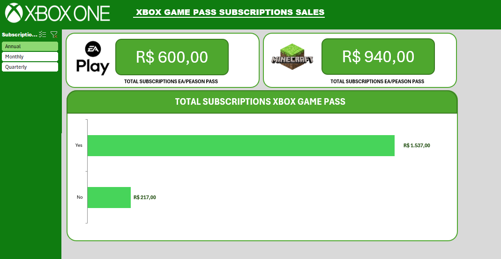

# Dashboard de Vendas do Xbox com Excel

Este projeto consiste em um dashboard interativo desenvolvido no Excel para análise de vendas do Xbox. Ele foi projetado para fornecer insights detalhados sobre o desempenho de vendas, tendências e métricas importantes, utilizando gráficos e tabelas dinâmicas.

## Funcionalidades

- Visualização de dados de vendas por período.
- Análise de tendências de vendas.
- Identificação de produtos mais vendidos.
- Gráficos interativos e tabelas dinâmicas.

## Tecnologias Utilizadas

- **Microsoft Excel**: Para criação do dashboard e análise de dados.

## Como Utilizar

1. Abra o arquivo `DASHBOARD DE VENDAS DO XBOX COM EXCEL.xlsx` no Microsoft Excel.
2. Navegue pelas abas para visualizar os diferentes gráficos e tabelas.
3. Utilize os filtros disponíveis para personalizar a análise de dados.

## Sobre Mim

Sou um entusiasta em análise de dados e visualização, com experiência em criar dashboards que transformam dados complexos em insights acionáveis. Este projeto é um exemplo do meu trabalho e da minha habilidade em utilizar ferramentas como o Excel para resolver problemas de negócios.

## Licença

Este projeto é licenciado sob a Licença MIT. Veja o arquivo LICENSE para mais detalhes.